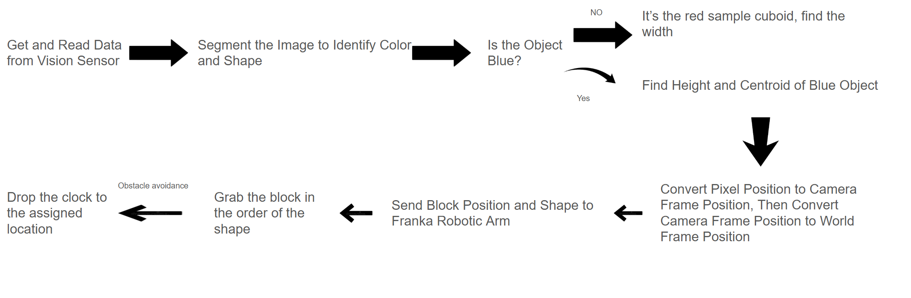
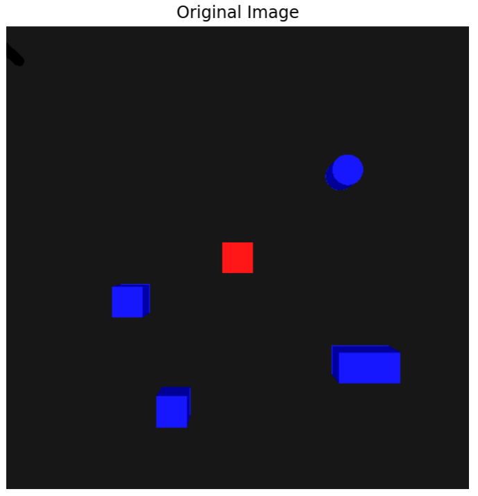
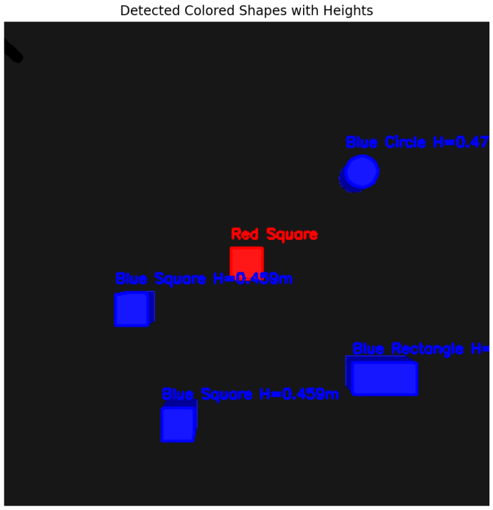
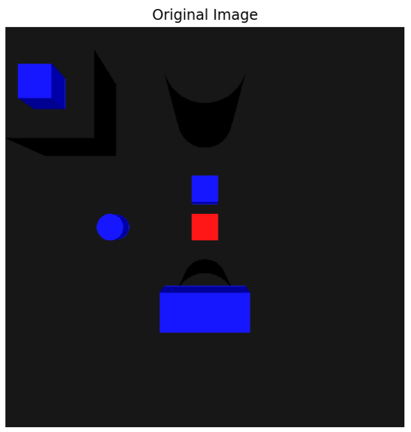
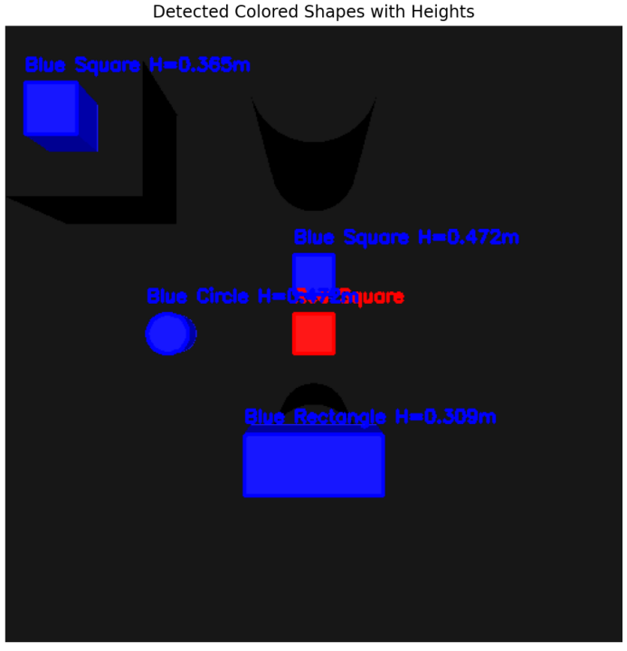

# Autonomous Object Classification and Manipulation Robotic Arm in 3D Simulation

## Team Member and Roles
- **Kechang (Ken) Wan**: Identify Color and Distinguish Color, threshold, segmentation, find height, pixel to position function, IK, CoppeliaSim setup, Organize and comment code, presentation PowerPoint, final project report, test
- **Tiancheng Pu**: Obstacle avoidance for path planning, IK, segmentation, presentation PowerPoint,test and final project report
- **Xiaorong Wang**:CoppeliaSim set up for three demo simulations, object detection and grasping, robot arm movement, finding the centroid, segmentation, pixel-to-position function, IK, presentation PowerPoint, test and final project report
- **Yaodan Zhang**: Segmentation, path planning, obstacle avoidance, ik, generate plot, presentation PowerPoint, test and final project report

 

## Introduction
The original intention of choosing this robot was to explore the application of robotics in practical scenarios deeply and to combine theory with practice. Robotics is becoming increasingly important in modern industry, medical care, service, and other fields, and this problem simulates a complex robot task scenario, providing an excellent opportunity to solve real-world engineering problems, such as garbage classification. By completing this robot, you can not only consolidate the theoretical knowledge learned in the course but also help improve your understanding of robot kinematics and dynamics.

This project runs through many core concepts in the ECSE275 course, including forward kinematics and inverse kinematics: calculating the position and attitude of the end effector through forward kinematics, and solving joint angles through inverse kinematics to achieve specific target position; Jacobian matrix and singularity analysis: study the velocity propagation, force transfer and possible singularity issues of the end effector under a specific configuration; DH parameter modeling: use the Denavit-Hartenberg method to model the robot structure, accurately describe its kinematic chain; path planning and motion control: design a reasonable path planning algorithm to ensure that the robot can efficiently complete the scheduled tasks, and verify its effectiveness in the simulation environment; simulation and verification: verify the theoretical model through tools such as CoppeliaSim The correctness and practical feasibility provide a reference for subsequent physical implementation.

The final result will be a complete robot simulation system. In CoppeliaSim, through intuitive simulation demonstrations, the entire process of the robot's end effector completing specified tasks, such as accurately grabbing, moving, and manipulating objects, is demonstrated. The system will embody the following key capabilities: achieve precise control of end-effector motion through inverse kinematics and path planning algorithms; respond to task requirements under different environmental conditions and constraints to ensure that the robot can successfully complete operations; demonstrate path planning or motion control algorithms Optimization effects in terms of efficiency and energy consumption.
Through this project, not only can the application value of the theories learned be fully demonstrated, but also the ability to solve complex engineering tasks can be improved in practical problems while laying a solid foundation for further learning and research in the field of robotics.

 

## Approach

### 1. Methods
##### Segmentation
To preprocess the image for segmentation, we first apply Gaussian blur to reduce noise and enhance the target area. Then, morphological operations (e.g., opening) further remove small noise while preserving the target shape. Comparing the preprocessed image with the original shows it is cleaner and highlights the target area better. The image is converted from RGB to HSV color space for color segmentation, which more effectively represents hue, saturation, and brightness. In HSV, red spans two ranges, combined into a single red mask, while a blue mask is similarly defined. These masks enable clear segmentation of red and blue regions without shadow interference. After segmentation, the contours of the target areas are extracted using `cv2.findContours()`. An area threshold filters out small, irrelevant contours, focusing on meaningful regions. Shape analysis follows, calculating circularity (from perimeter and area) to identify circles. Polygon fitting detects vertices, distinguishing shapes like rectangles or squares. Aspect ratio and angles further differentiate between squares and rectangles. These steps ensure accurate shape identification in the image.

##### Height determination
To find the height of an object from a pixel map, our first thought was to use the formula we learned in ECSE 275: z = f * X/x, but that formula can't be used here because the same formula is needed to find the object's coordinates in x. Y coordinates when converting from pixel position to camera frame position. This leaves us with two unknowns and one equation. So after looking at the image at different heights of the object, we find that the closer the object is to the camera, the larger the image is read. So the length and width of the reading will be inversely proportional to the distance from the camera. According to this relationship, we add a red cuboid in the workspace. This square is a fixed height, so we only need to enter his distance from the camera, we can get the height of other objects through the ratio of his length and width to the length and width of other objects.

##### Object grasping
To achieve object detection and grasping, the proximity sensor and toggle gripper are integrated to move the object from the platform to the separate drop point of three different shapes, which are the cylinder, rectangle, and cubic. For object detection, the proximity sensor is placed next to the gripper, when the gripper is near the object, the sensor can detect whether there is an object. 
We used the sim.setObjectParent function to grasp and release the object, when the sensor detects the object, the gripper will close and then move the object to the drop point. Once the object arrives in the correct position, the gripper will toggle to open.

##### Path planning
In the path planning part, we implemented obstacle avoidance using the Open Motion Planning Library (OMPL) to efficiently navigate around obstacles. Our approach involves two main functions: setup_obstacle_avoidance and execute_obstacle_avoidance.
The setup_obstacle_avoidance function establishes an obstacle avoidance task and then plans a path around the obstacles. Using sim.ompl.createStateSpace(), we defined the state space, specifying the boundaries for movement. We adopted the RRTConnect algorithm, a fast and efficient planning method, ideal for handling complex environments with multiple obstacles.
The execute_obstacle_avoidance function performs the actual planning and movement. We use sim.ompl.compute() method to calculate a feasible path within a specified time limit and retry attempts. If successful, the planned path will be iteratively executed, updating the object's position and orientation in each step. This systematic approach allowed the object to navigate complex scenarios while effectively avoiding collisions.

### 2. Flow Chart
To achieve accurate recognition, positioning, and grasping of objects, we designed an integrated system based on visual sensors and robotic arms. The entire process is divided into multiple stages, each of which has a specific function, from image data acquisition and processing to the final object grasping and placement. The following flowchart clearly shows the operating logic of the system, including from image segmentation and object attribute recognition, to using pixel coordinates to calculate the actual position of the object and guiding the robotic arm to complete the complete process of obstacle avoidance and precise placement.

  
  
 
  Figure 1: Flow chart

 

## Result

### 1. Test results
Based on the approaches mentioned above, we successfully achieved the preset objectives of the project, including classification shapes, obtaining XYZ parameters, Franka arm grasping and placing, and obstacle avoidance.

We randomly positioned cubes, rectangles, and cylinders of identical color within the scene and employed the segmentation method to accurately identify the shape of each object. The results demonstrate the successful recognition of each object's corresponding shape, as illustrated in Figures 1 and 2. After 100 identifications in the test, the accuracy rate reached 97%, ensuring the effectiveness.

 

 
  
  
  Figure 2： Original Image

 

 

  
   
  
  Figure 3： Detected Shapes (without obstacle)

  

Subsequently, we went on to obtain coordinates of the randomly distributed objects that were successfully identified in the scene. Using the relationship between an object's distance from the camera and its perceived size in the pixel map, we successfully determined the coordinates in the x,y, and z-axis of each recognized object, and documented the obtained coordinates into a chart, as shown in Table 1.

| Shape           | X (m)  | Y (m)  | Z (m)  |
|-----------------|--------|--------|--------|
| Blue Square     | 0.124  | 0.077  | 0.141  |
| Blue Square     | 0.251  | 0.126  | 0.141  |
| Blue Rectangle  | 0.174  | 0.130  | 0.141  |
| Blue Circle     | 0.405  | 0.130  | 0.141  |

*Table 1: Computed World Position for the shapes (without obstacles)*

For the object grasping part, the Franka robotic arm successfully grasped all objects in the scene during the test using the setObjectParent method and accurately delivered them to their corresponding target points then placed them down. The process was executed with precision, as shown in the GIF 1.

*GIF 1: System Operation Process (without obstacles)*

The following is the video link of the flat-display without obstacles:  https://youtu.be/-TAVja5xO-k?si=IoWooIMFR7go3syW

Subsequently, we added obstacles to the scene, randomly rearranged the three types of objects, and incorporated obstacle avoidance logic to repeat the above process. This was done to validate the system's capability for obstacle avoidance. As shown in Figures 4 and 5, the objects in the scene were still successfully recognized after the obstacles were added, and the accuracy kept high at 91% during 100 identifications. The coordinate parameters of objects can also be obtained successfully, as shown in Table 2.

 

 
  
  
  Figure 4: Original Image (with obstacles)

 

 

  
   
  
  Figure 5: Detected Shapes (with obstacles)

  

| Shape           | X (m)  | Y (m)   | Z (m)  |
|-----------------|--------|---------|--------|
| Blue Square     | 0.353  | 0.001   | 0.127  |
| Blue Square     | 0.455  | 0.181   | 0.234  |
| Blue Rectangle  | 0.224  | 0.0007  | 0.291  |
| Blue Circle     | 0.301  | 0.130   | 0.127  |

*Table 2: Computed World Position for the shapes (with obstacles)*

With the integration of obstacle avoidance logic, the robotic arm was still able to successfully grasp the target objects to their corresponding target points, and detect obstacles along the way, navigating around them effectively, as shown in GIF 2.

*GIF 2: System Operation Process (with obstacles)*

The following is the video link of the different heights-display with obstacles: https://youtu.be/7OF006pv-80?si=xQBR7pbxKFBK_7WA

### 2. Possible problems and improvements
In our system, the obstacle avoidance logic is based on the manipulation Sphere that drives the robotic arm's movement. This design can occasionally result in the situation that the manipulation Sphere successfully avoids obstacles while the following robotic arm gets obstructed, limiting the system's effectiveness. To address this issue, the obstacle avoidance logic could be applied directly to the robotic arm instead of the manipulation Sphere, or multiple points on the robotic arm could be integrated into the obstacle avoidance logic to ensure a more comprehensive solution.

In our system, placing a target point directly behind the Franka robotic arm causes the arm to reach a singularity, rendering it uncontrollable and causing inverse kinematics to fail. Out of 20 attempts, the robotic arm avoided the singularity only one time. When we placed the target point appropriately, however, the robotic arm never reached the singularity, ensuring that the arm remained controllable and the inverse kinematics functioned as intended. This consistent performance met the team's pre-established success metrics.

 

## Conclusion
In this project, we developed a system using a Franka robotic arm that classifies random-height objects based on their shape. The system contains a vision sensor that recognizes key features such as the shape (cylinder, rectangle, or cubic) and height of an object, allowing the robot to successfully pick up and place the object in a designated location based on its classification. The system performed as expected and successfully completed the task of categorizing objects based on their shape.

Looking forward, one key way to improve the system would be to add a second vision sensor to mimic the functionality of human binocular vision. This would help eliminate the need for a fixed reference point (e.g., a red square) in the workspace. The dual sensor system will provide better depth perception, allowing the system to more accurately localize the height of objects. In addition, improving the system's ability to handle shadow effects - distinguishing shadows from actual objects - will further improve the accuracy of object localization, especially for those objects that are farther away from the central point, and enhance the system's reliability in a variety of lighting conditions. These future improvements will make the system more robust and capable of handling a wider range of objects and environments.

